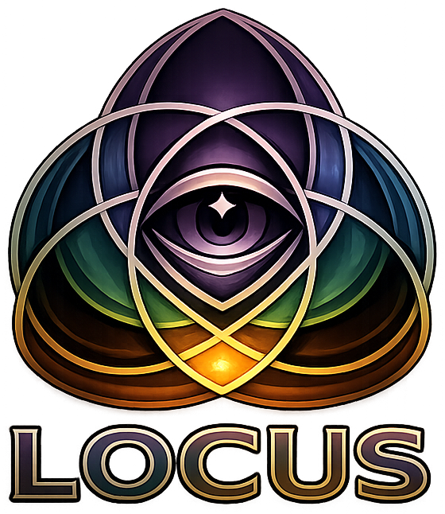

<p align="center">
  
</p>

# Locus

Graph Walker for AI agents. Point it at any repository and walk the symbol graph -- probe symbols, trace scenarios, query the Architect's Book, render diagrams. Via CLI or MCP server.

## Quick Start

```bash
go install github.com/dpopsuev/locus/cmd/locus@latest
```

### MCP Configuration (Cursor / Claude Desktop)

```json
{
  "mcpServers": {
    "locus": {
      "command": "locus",
      "args": ["serve"]
    }
  }
}
```

Locus runs as a local stdio process with full filesystem access and native Go toolchain.

## The Problem

LLM agents need structural context to make good decisions. Without it, they grep blindly, read files one at a time, and miss coupling, churn, layering, and trust boundaries. Locus scans any repository and produces a symbol graph that agents walk through MCP tools.

## Graph Walker Workflow

```
scan → probe → scenario → book → diagnose
```

1. **Scan** (`codograph scan_local`) -- build the symbol graph, get a `cache_key`
2. **Probe** (`analysis probe`) -- all vitals for one symbol (fan-in, fan-out, instability, circuits)
3. **Scenario** (`analysis scenario`) -- trace upstream to entry points, downstream to leaves
4. **Book** (`book`) -- query the Architect's Book for diagnostic knowledge
5. **Diagnose** (`analysis diagnose`) -- one-call composite: probe + book lookup

The agent starts broad (scan), zooms into a symbol (probe), traces its context (scenario), then interprets signals with knowledge (book/diagnose).

## MCP Tools

| Tool | Description |
|------|-------------|
| **codograph** | Scan and compare repository architectures. Actions: `scan_local`, `scan_remote`, `history`, `diff`, `status`, `set_desired_state`, `get_desired_state`, `accept_violation`, `flush`. Returns `cache_key` for downstream tools. |
| **analysis** | Symbol graph analysis with 4 primitives + extended actions. See full action list below. Pass `cache_key` to avoid re-scanning. |
| **book** | Query the Architect's Book -- knowledge graph with 28 entries and 43 typed edges (violates, measured_by, confused_with, remediation). Input: keywords + hops. |
| **render_diagram** | Render Mermaid diagrams. 16 types: dependency, c4, coupling, churn, layers, tree, classes, sequence, er, interfaces, hexa, zones, dataflow, callgraph, state, symbol_dsm. |
| **context** | Read and write project-specific knowledge. Per-project memory stored under XDG, git-aware staleness detection. |
| **triage** | Map natural language intent to ranked tool list (no LLM). |

## Analysis Actions

### Symbol Primitives

| Action | What it does |
|--------|-------------|
| `probe` | All vitals for one symbol -- fan-in, fan-out, instability, cross-pkg, circuits |
| `scenario` | Trace upstream to entry points, downstream to leaves. N depth. Stress metrics |
| `convergence` | Where N symbols' downstream trees overlap. Gradient counts |
| `isolate` | Remove a symbol -- what disconnects? |

### Diagnostics

| Action | What it does |
|--------|-------------|
| `diagnose` | One-call composite: probe + Book lookup |
| `islands` | Find symbols unreachable from entry points (dead code) |
| `explain_edge` | Source snippet for a specific edge between two symbols |
| `symbol_diff` | Compare two SymbolGraphs by SHA |

### Call Graph

| Action | What it does |
|--------|-------------|
| `callers` | Who calls this symbol? |
| `callees` | What does this symbol call? |
| `call_path` | Path between two symbols in the call graph |
| `symbol_graph` | Full symbol graph for a repository |
| `symbol_search` | Search symbols by name pattern |
| `resolve` | Resolve locator → FQN / file:line (`Symbol` \| `Parent.Symbol` \| `path:Symbol` \| `path:line:Symbol`) |
| `definition` | Go-to-definition via WarmLSP (locator → location(s)) |
| `references` | Find-references via WarmLSP (compact file:line list) |
| `show` | documentSymbol body slice + outline (**not** definition) |
| `rename` | prepareRename + WorkspaceEdit; dry-run default; `--apply` / `apply:true` writes + rebinds graph |
| `pipelines` | Detect linear call chains (minimum length filter) |

### Architecture

| Action | What it does |
|--------|-------------|
| `deps` | Dependencies for a component |
| `impact` | Blast radius for a component |
| `coupling` | Coupling table, hot spots, or edge list |
| `cycles` | Circular dependency detection |
| `violations` | Layer violation detection |
| `risk_scores` | Risk scoring across components |
| `component` | Detail view of a single component |
| `search` | Search components by name |
| `query` | Natural language query over architecture |
| `scan_diff` | Diff between two scans by SHA |
| `preset` | Run a named preset (architecture_review, health_check, onboarding, pre_pr, full_clinic, code_health) |
| `mesh` | Weighted symbol mesh with views: full, neighborhood, distance, boundaries, aggregate |

## Supported Languages

Locus uses LSP servers as the primary analysis backend (Strangler Fig -- non-LSP backends rejected for call graph). Fail-fast: if LSP unavailable, returns error naming the required server.

| Language | LSP Server | Scanner Fallback |
|----------|-----------|-----------------|
| Go | gopls | go/ast + go/packages |
| Rust | rust-analyzer | Cargo.toml + regex |
| Python | pyright | tree-sitter-python |
| TypeScript/JS | typescript-language-server | tree-sitter-typescript |
| C/C++ | clangd | #include + ctags |
| Java | jdtls | ctags fallback |
| Kotlin | kotlin-language-server | ctags fallback |
| C# | omnisharp | ctags fallback |
| Swift | sourcekit-lsp | ctags fallback |
| Zig | zls | regex fallback |

Additional languages supported via tree-sitter, ctags, or regex scanners: Lua, Proto/gRPC, Shell.

## Architect's Book

28 knowledge entries in a graph with 43 typed edges. Embedded in the Oculus binary via `embed.FS`. Query with keywords + hops to get a knowledge subgraph with typed relationships.

**Categories:** metrics (fan-in, fan-out, instability, LOC, churn, LCOM, distance-from-main-sequence), smells (9 Fowler), principles (SOLID + hexagonal + coupling + cohesion), patterns (facade, strategy, mediator, factory).

**Edge types:** violates, measured_by, confused_with, remediation, feeds, part_of, distinguished_by.

## Container

The Locus container bundles 5 core LSP servers for immediate multi-language analysis:

| Server | Language |
|--------|----------|
| gopls | Go |
| rust-analyzer | Rust |
| pyright | Python |
| typescript-language-server | TypeScript/JavaScript |
| clangd | C/C++ |

```bash
podman run --rm -i -v /path/to/repo:/path/to/repo:rbind \
  locus:latest serve --transport http --addr :8081
```

Additional LSP servers (jdtls, kotlin-language-server, omnisharp, sourcekit-lsp, zls) can be installed manually for extended language support.

## Diagram Types

16 diagram types, all rendered as Mermaid:

| Type | Description |
|------|-------------|
| `dependency` | Component dependency flowchart with health colors |
| `c4` | C4 component diagram |
| `coupling` | Sankey flow diagram showing coupling weights |
| `churn` | Bar chart of churn over time |
| `layers` | Layered architecture view |
| `tree` | Mindmap with health markers |
| `classes` | Class diagram with health colors |
| `sequence` | Call trace from an entry point |
| `er` | Entity-relationship diagram |
| `interfaces` | Interface implementation graph |
| `hexa` | Hexagonal architecture (ports/adapters) |
| `zones` | Architecture zones with health |
| `dataflow` | DFD with trust boundaries |
| `callgraph` | Function call graph |
| `state` | State machine detection |
| `symbol_dsm` | Symbol-level Design Structure Matrix |

Options: `theme` (light/dark/natural), `enrich` (loc, fan_in, churn on node labels), `format` (mermaid/facts/both), `exported_only`, `scope`, `entry`.

## Configuration

| Variable | Default | Description |
|----------|---------|-------------|
| `LOCUS_STORE` | `filesystem` | Storage backend |
| `LOCUS_CACHE_DIR` | `~/.locus/cache` | Scan cache directory |
| `LOCUS_HISTORY_DIR` | `~/.locus/history` | Codograph history directory |
| `LOCUS_TRANSPORT` | `stdio` | Transport: `stdio`, `http` |
| `LOCUS_ADDR` | `:8081` | Listen address (HTTP only) |
| `LOCUS_THEME` | `natural` | Default diagram theme: `light`, `dark`, `natural` |
| `LOCUS_THEME_FILE` | `~/.locus/theme.yaml` | Custom theme override file |
| `LOCUS_LOG_LEVEL` | `info` | Log level: `debug`, `info`, `warn`, `error` |

## License

MIT
