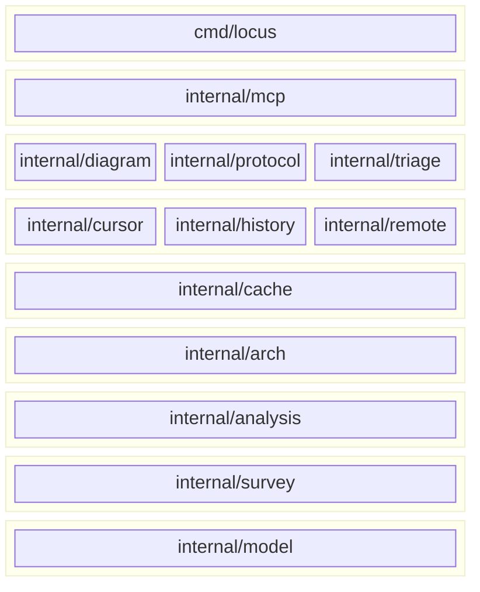
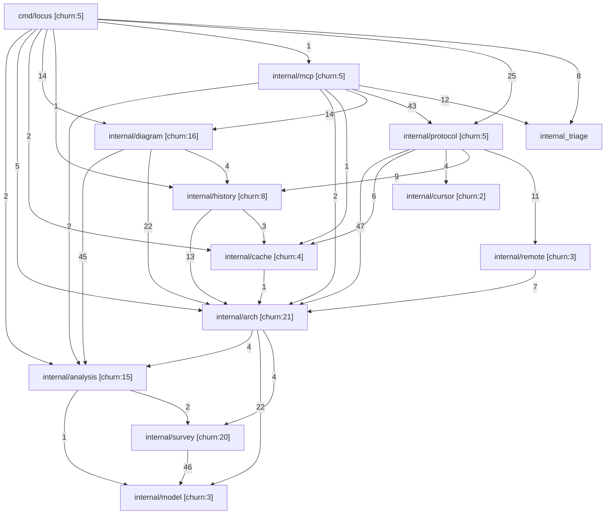
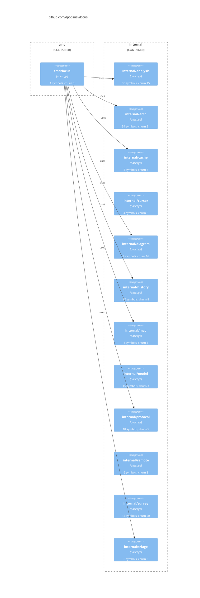
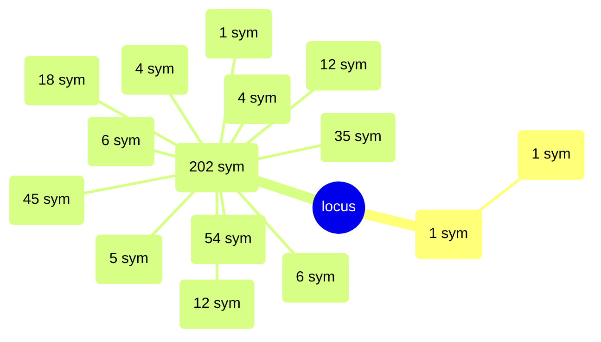
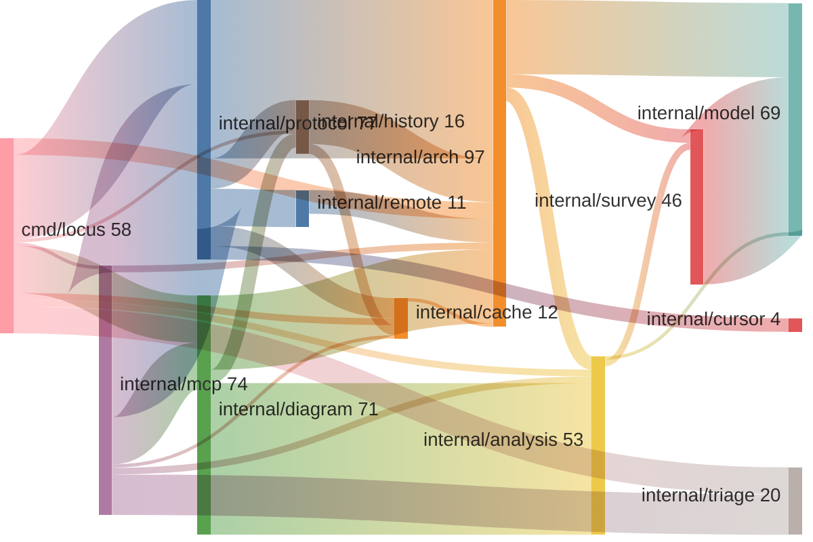
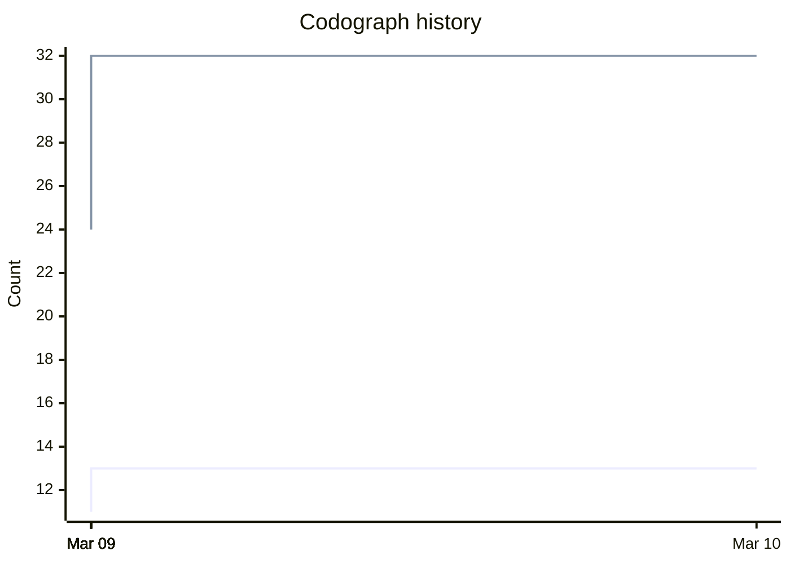
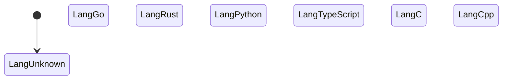

# Locus

Spatial context bus for AI agents. Point it at any repository and get architecture, dependency graph, churn, hot spots, and symbols -- via CLI or MCP server. No ceremony.

## Quick Start

### Container (recommended)

```bash
# podman or docker -- mount your workspace for local scanning
podman run -d --name locus \
  -p 8081:8081 \
  -v locus-data:/data \
  -v ~/Workspace:/workspace:ro \
  quay.io/dpopsuev/locus:latest
```

### Binary

```bash
go install github.com/dpopsuev/locus/cmd/locus@latest
locus serve                           # stdio (Cursor, Claude Desktop)
locus serve --transport http          # Streamable HTTP on :8081
```

### MCP Configuration

**Cursor / Claude Desktop (stdio -- local binary):**

```json
{
  "mcpServers": {
    "locus": {
      "command": "locus",
      "args": ["serve"]
    }
  }
}
```

**Cursor / Claude Desktop (HTTP -- container):**

```json
{
  "mcpServers": {
    "locus": {
      "url": "http://localhost:8081/"
    }
  }
}
```

## The Problem

LLM agents need to understand codebases to make good decisions. Without structural context, they grep blindly, read files one at a time, and miss the big picture -- coupling, churn, layering, trust boundaries.

This creates three failure modes:

1. **Blind navigation.** The agent reads files sequentially without knowing which packages matter or how they connect.
2. **Missing risk signals.** High-churn, high-coupling components are invisible unless the agent happens to stumble on them.
3. **No shared vocabulary.** Without a component model, the agent can't discuss architecture with the developer in structural terms.

Locus solves this by scanning any repository and producing a structured context report -- components, dependencies, symbols, churn, hot spots, nesting depth, LOC -- that agents consume through MCP tools. The agent gets the whole architecture in one call.

## Workflow

In the intended mode of operation, **the LLM agent does the whole ceremony for you**. You point it at a repo, and it calls Locus MCP tools to scan, query, diagram, and triage on your behalf. The CLI examples below show what's happening under the hood.

### 1. Scan

```bash
locus scan . --format md      # markdown report
locus scan . --format json    # structured JSON for programmatic use
```

### 2. Query

```bash
locus hot-spots .             # high fan-in + high churn components
locus coupling .              # coupling table: fan-in, fan-out, churn, symbols
locus deps . --component internal/arch   # fan-in/fan-out for one component
locus cycles .                # circular dependencies and layer violations
locus evolution .             # architecture growth across commits
locus health                  # server health check
```

### 3. Diagram

```bash
locus diagram . --type dependency   # package dependency flowchart
locus diagram . --type c4           # C4 component diagram
locus diagram . --type layers       # layered block diagram
locus diagram . --type tree         # mindmap overview
locus diagram . --type coupling     # Sankey flow of import weights
locus diagram . --type churn        # XY chart of codograph history
locus diagram . --type classes      # class diagram with interfaces
locus diagram . --type er           # entity-relationship diagram
locus diagram . --type sequence --entry main   # sequence diagram from entry point
locus diagram . --type callgraph --entry Scan  # call graph from function
locus diagram . --type dataflow --entry main   # data flow diagram
locus diagram . --type state        # state machine detection
```

### 4. Triage

```bash
locus triage "where are the hot spots?"    # maps intent to ranked tool list
locus triage --list                        # all tools grouped by category
```

## Architecture

> Every diagram below was generated by running Locus on itself. If the architecture changes, re-running the commands updates the README.

### Layer Diagram

> `locus diagram . --type layers`



### Dependency Graph

> `locus diagram . --type dependency`



### C4 Component Diagram

> `locus diagram . --type c4`



### Tree / Mindmap

> `locus diagram . --type tree`



### Coupling Flow (Sankey)

> `locus diagram . --type coupling`



### Churn Timeline

> `locus diagram . --type churn`



### State Machine Detection

> `locus diagram . --type state`



### Additional Diagram Types

The following diagram types produce large, detailed output best viewed interactively rather than inline. Run the commands to generate them for any repository:

```bash
# Class diagram -- all structs, interfaces, and implementation edges
locus diagram . --type classes
locus diagram . --type classes --exported-only   # exported symbols only

# Entity-Relationship -- struct fields and composition relationships
locus diagram . --type er

# Sequence diagram -- call trace from an entry point function
locus diagram . --type sequence --entry ScanAndBuild

# Call graph -- function-level call edges, clustered by package
locus diagram . --type callgraph --entry ScanProject

# Data flow -- DFD with trust boundaries and data stores
locus diagram . --type dataflow --entry main
```

### Hot Spots

> `locus scan . --format md` (Hot Spots section)

Components with the highest combination of fan-in (many dependents) and churn (frequent changes) -- the riskiest parts of the codebase:

| Component | Fan-In | Churn | Nesting |
|-----------|--------|-------|---------|
| internal/arch | 7 | 21 | 4 |
| internal/survey | 3 | 20 | 7 |
| internal/analysis | 4 | 15 | 7 |
| internal/history | 3 | 8 | 2 |

### Components

> `locus scan . --format md` (Components section)

| Component | Package | Churn | Symbols |
|-----------|----------|-------|---------|
| cmd/locus | `github.com/dpopsuev/locus/cmd/locus` | 5 | 1 |
| internal/analysis | `github.com/dpopsuev/locus/internal/analysis` | 15 | 48 |
| internal/arch | `github.com/dpopsuev/locus/internal/arch` | 21 | 75 |
| internal/cache | `github.com/dpopsuev/locus/internal/cache` | 4 | 14 |
| internal/cursor | `github.com/dpopsuev/locus/internal/cursor` | 2 | 8 |
| internal/diagram | `github.com/dpopsuev/locus/internal/diagram` | 16 | 25 |
| internal/history | `github.com/dpopsuev/locus/internal/history` | 8 | 22 |
| internal/mcp | `github.com/dpopsuev/locus/internal/mcp` | 5 | 1 |
| internal/model | `github.com/dpopsuev/locus/internal/model` | 3 | 53 |
| internal/protocol | `github.com/dpopsuev/locus/internal/protocol` | 5 | 31 |
| internal/remote | `github.com/dpopsuev/locus/internal/remote` | 3 | 9 |
| internal/survey | `github.com/dpopsuev/locus/internal/survey` | 20 | 47 |
| internal/triage | `github.com/dpopsuev/locus/internal/triage` | 3 | 15 |

## Packages

| Package | Role |
|---|---|
| `cmd/locus` | CLI entry point (Cobra). Every MCP tool has a CLI equivalent. |
| `internal/mcp` | MCP server. Thin handlers that delegate to `protocol`. |
| `internal/protocol` | All business logic: scan, diff, coverage, cycles, evolution. Both CLI and MCP call through this layer. |
| `internal/arch` | Architecture model: scan, render (JSON/Markdown/Mermaid), churn, hot spots, cycles, coverage, API surface. |
| `internal/analysis` | Type analysis (classes, interfaces, field refs, call chains, nesting) and deep analysis (call graph, data flow, state machines) with LSP, Tree-sitter, and regex backends. |
| `internal/diagram` | Mermaid diagram renderers for all 12 diagram types. |
| `internal/survey` | Language-specific scanners: Go, Rust, Python, TypeScript, C/C++, LSP, ctags. |
| `internal/model` | Data model: `Project`, `Namespace`, `File`, `Symbol`, `DependencyGraph`. |
| `internal/cache` | Scan cache keyed by git HEAD SHA. Repeated scans are instant. |
| `internal/history` | Codograph history: record, list, diff between snapshots. |
| `internal/remote` | Shallow-clone remote repos, scan, cache by URL+SHA. |
| `internal/cursor` | Read `.cursor/rules` and `.cursor/skills` from workspaces. |
| `internal/triage` | Intent-to-tool routing. Pure keyword matching, no LLM. |

## MCP Tools

| Tool | Description |
|---|---|
| `scan_project` | Full codebase context: architecture, deps, churn, symbols. Results cached by git HEAD SHA. |
| `suggest_depth` | Optimal `--depth` grouping level for a repo. |
| `get_hot_spots` | High fan-in + high churn components (risk areas). |
| `get_dependencies` | Fan-in/fan-out edges for a specific component. |
| `get_coupling_table` | Package coupling: fan-in, fan-out, churn, symbol count. Pre-formatted. |
| `get_edge_list` | Dependency edge list, optional component filter. |
| `get_rules` | `.cursor/rules` for a workspace. |
| `get_skills` | `.cursor/skills` for a workspace. |
| `codograph_remote` | Scan a remote GitHub repo via shallow clone. Cached by URL+SHA. |
| `get_codograph_history` | Past codographs with timestamps, SHAs, component/edge counts. |
| `diff_codographs` | Diff between two most recent codographs: added/removed components, edges, churn deltas. |
| `diff_branches` | Architecture diff between two git branches (cache-aware). |
| `get_cycles` | Circular dependencies, import depth, layer purity. |
| `get_coverage` | Per-component test coverage percentages. |
| `get_api_surface` | Exported symbol counts and trust boundary crossings. |
| `validate_architecture` | Diff desired-state architecture (Mermaid/JSON) against live scan. |
| `render_diagram` | Mermaid diagrams: dependency, c4, coupling, churn, layers, tree, classes, sequence, er, dataflow, callgraph, state. |
| `architecture_evolution` | Scan architecture at multiple commits to show structural growth over time. Returns timeline of component/edge/LOC counts with per-step diffs. |
| `get_conventions` | Detect coding conventions: naming patterns, file structure, test patterns, config formats. |
| `get_impact` | Change impact analysis: direct/transitive dependents, blast radius percentage, risk level. |
| `get_knowledge_gaps` | Find undocumented or under-tested components based on codograph data. |
| `health_check` | Server health summary: cache status, history availability, workspace roots. |
| `triage` | Map natural language intent to ranked tool list (no LLM). |

## Triage

Locus includes a built-in intent router that maps natural language queries to the right tool chain without an LLM:

```bash
$ locus triage "where are the hot spots?"
```

```json
{
  "category": "architecture",
  "confidence": 0.037,
  "tools": [
    {
      "name": "get_hot_spots",
      "params": { "top_n": 10 },
      "reason": "Structural hot spots reveal design pressure points"
    }
  ]
}
```

All tools grouped by category:

| Category | Tools |
|---|---|
| architecture | `scan_project`, `suggest_depth`, `get_hot_spots`, `get_coupling_table`, `get_edge_list`, `codograph_remote`, `get_cycles`, `get_api_surface`, `validate_architecture`, `render_diagram`, `architecture_evolution` |
| onboarding | `scan_project`, `get_rules`, `get_skills`, `codograph_remote` |
| performance | `get_hot_spots`, `get_coupling_table`, `get_cycles` |
| refactoring | `get_hot_spots`, `get_dependencies` |
| dependencies | `get_dependencies`, `get_coupling_table`, `get_edge_list`, `get_cycles` |
| comparison | `diff_codographs`, `diff_branches` |
| review | `diff_branches` |
| churn | `get_codograph_history`, `diff_codographs` |
| history | `get_codograph_history`, `architecture_evolution` |
| testing | `get_coverage` |
| quality | `get_coverage` |
| security | `get_api_surface` |
| compliance | `validate_architecture` |
| visualization | `render_diagram` |
| governance | `get_rules` |
| meta | `health_check`, `triage` |

## Supported Languages

| Language | Scanner | Symbols | Dependencies |
|---|---|---|---|
| Go | `go/ast` native | functions, types, methods, interfaces | import graph with call-site coupling |
| Rust | Cargo.toml + regex | functions, structs, traits, impls | crate dependency graph |
| Python | AST regex + pyproject.toml | functions, classes | import graph |
| TypeScript | package.json + regex | functions, classes, interfaces | import/require graph |
| C/C++ | `#include` + ctags | functions, structs, typedefs | include graph |
| Any | LSP (gopls, etc.) | workspace/symbol | references |
| Any | ctags (universal) | all ctags kinds | import heuristics |

## Configuration

| Variable | Default | Description |
|---|---|---|
| `LOCUS_CACHE_DIR` | `~/.locus/cache` | Scan cache directory |
| `LOCUS_HISTORY_DIR` | `~/.locus/history` | Codograph history directory |
| `LOCUS_TRANSPORT` | `stdio` | Transport: `stdio`, `http` |
| `LOCUS_ADDR` | `:8081` | Listen address (HTTP only) |

## License

MIT
