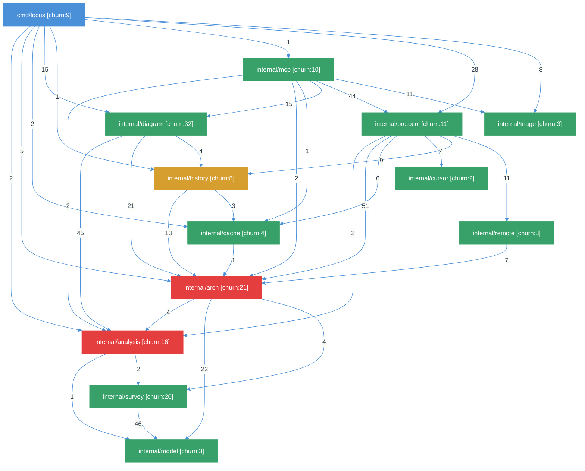
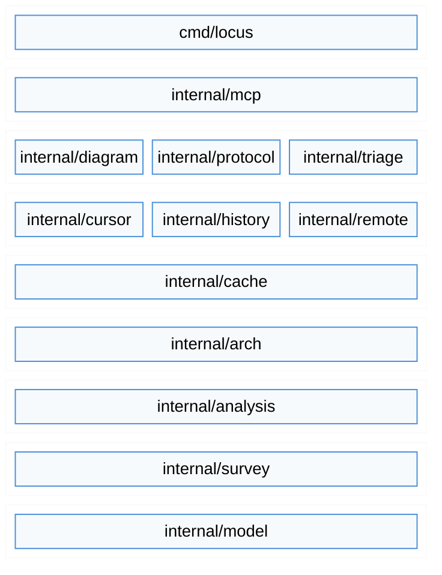
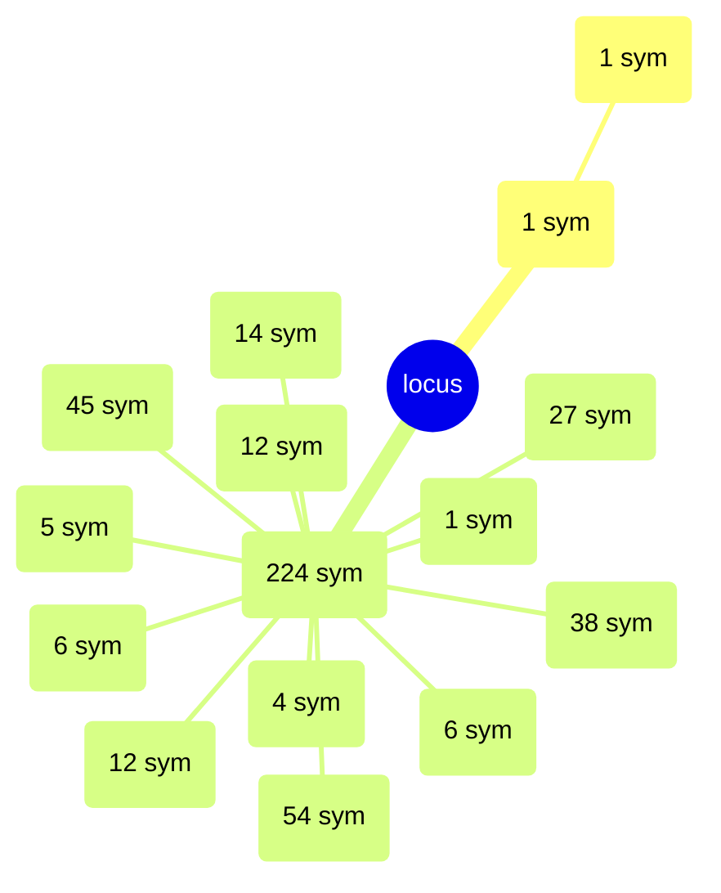
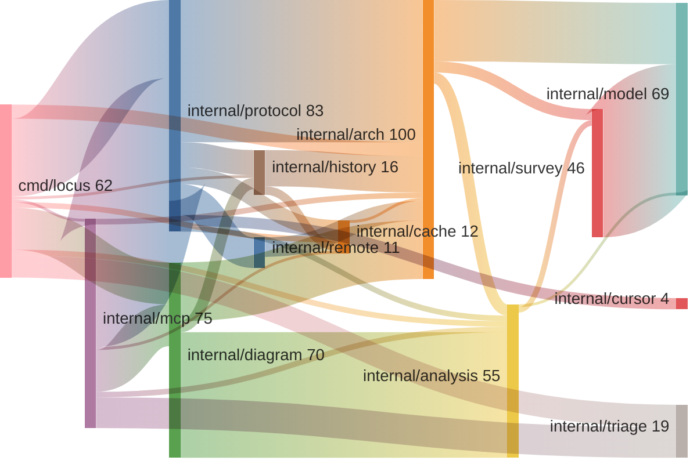

<p align="center">
  
</p>

# Locus

Spatial context bus for AI agents. Point it at any repository and get architecture, dependency graph, churn, hot spots, and symbols -- via CLI or MCP server. No ceremony.

## Quick Start

### Container (recommended)

```bash
# podman or docker -- mount your workspace for local scanning
podman run -d --name locus \
  -p 8081:8081 \
  -v locus-data:/data \
  -v ~/Workspace:/workspace:ro \
  quay.io/dpopsuev/locus:latest
```

### Binary

```bash
go install github.com/dpopsuev/locus/cmd/locus@latest
locus serve                           # stdio (Cursor, Claude Desktop)
locus serve --transport http          # Streamable HTTP on :8081
```

### MCP Configuration

**Cursor / Claude Desktop (stdio -- local binary):**

```json
{
  "mcpServers": {
    "locus": {
      "command": "locus",
      "args": ["serve"]
    }
  }
}
```

**Cursor / Claude Desktop (HTTP -- container):**

```json
{
  "mcpServers": {
    "locus": {
      "url": "http://localhost:8081/"
    }
  }
}
```

## The Problem

LLM agents need to understand codebases to make good decisions. Without structural context, they grep blindly, read files one at a time, and miss the big picture -- coupling, churn, layering, trust boundaries.

This creates three failure modes:

1. **Blind navigation.** The agent reads files sequentially without knowing which packages matter or how they connect.
2. **Missing risk signals.** High-churn, high-coupling components are invisible unless the agent happens to stumble on them.
3. **No shared vocabulary.** Without a component model, the agent can't discuss architecture with the developer in structural terms.

Locus solves this by scanning any repository and producing a structured context report -- components, dependencies, symbols, churn, hot spots, nesting depth, LOC -- that agents consume through MCP tools. The agent gets the whole architecture in one call.

## Workflow

Locus is designed for natural language. You talk to your agent, and it calls the right MCP tools behind the scenes.

> **You:** I just cloned this repo. What's the architecture?
>
> **Agent:** *(calls `codograph` with action `scan_local`)* The project has 13 packages across 2 layers. `internal/arch` is the core with 54 symbols and the highest churn (21 commits). `internal/protocol` is the gateway — everything routes through it. Here's the dependency diagram...

> **You:** Which parts are risky to change?
>
> **Agent:** *(calls `dependencies` with action `coupling`, view `hot_spots`)* Two components are in the danger zone: `internal/arch` (fan-in 7, churn 21) and `internal/analysis` (fan-in 4, churn 16). Both are deeply depended on and change frequently. I'd add tests before touching either.

> **You:** If I refactor internal/cache, what breaks?
>
> **Agent:** *(calls `dependencies` with action `impact`)* Blast radius is 38%. Direct dependents: `internal/protocol`, `internal/history`, `cmd/locus`. Transitive: everything that depends on those — 5 packages total. Risk level: medium.

> **You:** Show me the architecture as a layer diagram with health colors.
>
> **Agent:** *(calls `render_diagram` with type `layers`, theme `natural`)* Here you go — 9 layers from `cmd/locus` at the top to `internal/model` at the bottom. Red means high fan-in + high churn. Yellow is borderline.

## Architecture

> Every diagram below was generated by running `locus diagram . --theme natural` on itself. Components are colored by health: green = healthy, yellow = sick (fan-in >= 3, churn >= 8), red = fatal (fan-in >= 5, churn >= 15). Re-run to update.

### Dependency Graph

> `locus diagram . --type dependency --theme natural`



### Layer Diagram

> `locus diagram . --type layers --theme natural`



### C4 Component Diagram

> `locus diagram . --type c4 --theme natural`


### Tree / Mindmap

> `locus diagram . --type tree --theme natural` — health markers: ✘ = fatal, ⚠ = sick



### Coupling Flow (Sankey)

> `locus diagram . --type coupling --theme natural`



### Additional Diagram Types

These produce large output best viewed interactively. Run to generate for any repository:

```bash
locus diagram . --type classes --theme natural          # class diagram with health colors
locus diagram . --type classes --exported-only           # exported symbols only
locus diagram . --type er --theme natural                # entity-relationship
locus diagram . --type sequence --entry ScanAndBuild     # call trace from entry point
locus diagram . --type callgraph --entry ScanProject     # function call graph
locus diagram . --type dataflow --entry main             # DFD with trust boundaries
locus diagram . --type state                             # state machine detection
```

## Packages

| Package | Symbols | Churn | Role |
|---|---|---|---|
| `cmd/locus` | 1 | 9 | CLI entry point (Cobra). Every MCP tool has a CLI equivalent. |
| `internal/mcp` | 1 | 10 | MCP server. Thin handlers that delegate to `protocol`. |
| `internal/protocol` | 27 | 11 | All business logic: scan, diff, coverage, cycles, evolution. Both CLI and MCP call through this layer. |
| `internal/arch` | 54 | 21 | Architecture model: scan, render, churn, hot spots, cycles, coverage, API surface. |
| `internal/analysis` | 38 | 16 | Type analysis (classes, interfaces, field refs, call chains, nesting) and deep analysis (call graph, data flow, state machines). |
| `internal/diagram` | 14 | 32 | Mermaid diagram renderers for all 12 diagram types with theming. |
| `internal/survey` | 12 | 20 | Language-specific scanners: Go, Rust, Python, TypeScript, C/C++, LSP, ctags. |
| `internal/model` | 45 | 3 | Data model: `Project`, `Namespace`, `File`, `Symbol`, `DependencyGraph`. |
| `internal/cache` | 5 | 4 | Scan cache keyed by git HEAD SHA. Repeated scans are instant. |
| `internal/history` | 12 | 8 | Codograph history: record, list, diff between snapshots. |
| `internal/remote` | 6 | 3 | Shallow-clone remote repos, scan, cache by URL+SHA. |
| `internal/cursor` | 4 | 2 | Read `.cursor/rules` and `.cursor/skills` from workspaces. |
| `internal/triage` | 6 | 3 | Intent-to-tool routing. Pure keyword matching, no LLM. |

## MCP Tools

| Tool | Description |
|---|---|
| `codograph` | Scan and compare repository architectures. Actions: `scan_local` (full codebase context), `scan_remote` (GitHub via shallow clone), `history` (past scans, diff=true to compare), `diff` (compare git branches). |
| `dependencies` | Analyze component dependencies, impact, and coupling. Actions: `deps` (fan-in/fan-out), `impact` (blast radius), `coupling` (table, view=hot_spots/edges). |
| `get_cycles` | Cycles, coverage, API surface, conventions, or knowledge gaps. Use `analysis=cycles\|coverage\|api_surface\|conventions\|gaps`. |
| `render_diagram` | Mermaid diagrams: dependency, c4, coupling, churn, layers, tree, classes, sequence, er. Use `theme` (light/dark/natural). |
| `triage` | Map natural language intent to ranked tool list (no LLM). |

## LLM Chatbox Examples

Quick reference for what the agent sends over MCP. The Workflow section above shows full conversations.

```json
// Scan a repository
{ "tool": "codograph", "arguments": { "action": "scan_local", "path": "." } }

// Hot spots (high fan-in + high churn)
{ "tool": "dependencies", "arguments": { "action": "coupling", "path": ".", "view": "hot_spots" } }

// Blast radius for a refactor
{ "tool": "dependencies", "arguments": { "action": "impact", "path": ".", "component": "internal/arch" } }

// Dependency diagram with health colors
{ "tool": "render_diagram", "arguments": { "path": ".", "type": "dependency", "theme": "natural" } }

// Circular dependencies
{ "tool": "get_cycles", "arguments": { "path": "." } }

// Scan a remote GitHub repo
{ "tool": "codograph", "arguments": { "action": "scan_remote", "url": "github.com/org/repo" } }

// Diff architecture between branches
{ "tool": "codograph", "arguments": { "action": "diff", "path": ".", "branch_a": "main", "branch_b": "feature/x" } }

// "What tool should I use?"
{ "tool": "triage", "arguments": { "intent": "where are the hot spots?" } }
```

## Triage

Locus includes a built-in intent router that maps natural language queries to the right tool chain without an LLM:

```bash
$ locus triage "where are the hot spots?"
```

```json
{
  "category": "architecture",
  "confidence": 0.037,
  "tools": [
    {
      "name": "dependencies",
      "params": { "action": "coupling", "view": "hot_spots", "top_n": 10 },
      "reason": "Structural hot spots reveal design pressure points"
    }
  ]
}
```

All tools grouped by category:

| Category | Tools |
|---|---|
| architecture | `codograph scan_local`, `dependencies coupling`, `codograph scan_remote`, `get_cycles`, `render_diagram` |
| onboarding | `codograph scan_local`, `codograph scan_remote` |
| performance | `dependencies coupling` (view=hot_spots), `get_cycles` |
| refactoring | `dependencies coupling` (view=hot_spots), `dependencies deps`, `dependencies impact` |
| dependencies | `dependencies deps`, `dependencies coupling` (view=edges), `get_cycles` |
| comparison | `codograph history` (diff=true), `codograph diff` |
| review | `codograph diff` |
| churn | `codograph history` |
| testing | `get_cycles` (analysis=coverage) |
| quality | `get_cycles` (analysis=gaps) |
| security | `get_cycles` (analysis=api_surface) |
| visualization | `render_diagram` |
| meta | `triage` |

## Supported Languages

| Language | Scanner | Symbols | Dependencies |
|---|---|---|---|
| Go | `go/ast` native | functions, types, methods, interfaces | import graph with call-site coupling |
| Rust | Cargo.toml + regex | functions, structs, traits, impls | crate dependency graph |
| Python | AST regex + pyproject.toml | functions, classes | import graph |
| TypeScript | package.json + regex | functions, classes, interfaces | import/require graph |
| C/C++ | `#include` + ctags | functions, structs, typedefs | include graph |
| Any | LSP (gopls, etc.) | workspace/symbol | references |
| Any | ctags (universal) | all ctags kinds | import heuristics |

## Diagram Theming

Locus supports three visual themes for Mermaid diagrams: `light`, `dark`, and `natural` (default). Themes control colors, shapes, and health-based semantic coloring.

### Health Classification

Components are automatically classified by risk level based on fan-in and churn:

| Level | Condition | Color |
|---|---|---|
| **Healthy** | Default | Green |
| **Sick** | fan-in >= 3 AND churn >= 8 | Yellow |
| **Fatal** | fan-in >= 5 AND churn >= 15 | Red |

Health coloring is applied to dependency flowcharts, C4 component diagrams, churn bar charts, and tree mindmaps. Layer diagrams highlight violations in red.

### Theme Selection

```bash
locus diagram . --type dependency --theme dark
LOCUS_THEME=dark locus diagram . --type c4
```

Via MCP: pass `"theme": "dark"` in the `render_diagram` arguments.

### Custom Theme File

Place a `theme.yaml` in `~/.locus/` or set `LOCUS_THEME_FILE` to override default tokens:

```yaml
colors:
  green:
    dark: "#68D391"
    light: "#276749"
    natural: "#38A169"
shapes:
  component:
    fill: surface
    stroke: blue
    color: text
```

## Configuration

| Variable | Default | Description |
|---|---|---|
| `LOCUS_CACHE_DIR` | `~/.locus/cache` | Scan cache directory |
| `LOCUS_HISTORY_DIR` | `~/.locus/history` | Codograph history directory |
| `LOCUS_TRANSPORT` | `stdio` | Transport: `stdio`, `http` |
| `LOCUS_ADDR` | `:8081` | Listen address (HTTP only) |
| `LOCUS_THEME` | `natural` | Default diagram theme: `light`, `dark`, `natural` |
| `LOCUS_THEME_FILE` | `~/.locus/theme.yaml` | Custom theme override file |
| `LOCUS_LOG_LEVEL` | `info` | Log level: `debug`, `info`, `warn`, `error`. JSON to stderr. |

## License

MIT
